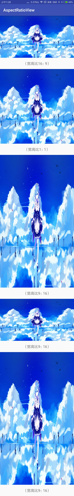

## AspectRatioImageView

工作中经常遇到加载图片变形的问题，所以写了这样的一个imageview，使用场景是宽高中的一边为match_parent或固定值，而另一边为wrap_content的时候，可以根据输入的宽高比自动计算wrap_content所对应的实际长度。当两边都为wrap_content时，没有固定值做依据，自动计算的功能实效。

### 使用方法
``` xml
<com.fenghebaiyang.aspectratioview.AspectRatioImageView
    android:layout_width="match_parent"
    android:layout_height="wrap_content"
    android:scaleType="fitXY"
    android:src="@mipmap/rem"
    app:ratio="16:9" />

<com.fenghebaiyang.aspectratioview.AspectRatioImageView
    android:layout_width="match_parent"
    android:layout_height="wrap_content"
    android:scaleType="fitXY"
    android:src="@mipmap/rem"
    app:ratio="1:1" />

<com.fenghebaiyang.aspectratioview.AspectRatioImageView
    android:layout_width="match_parent"
    android:layout_height="wrap_content"
    android:scaleType="fitXY"
    android:src="@mipmap/rem"
    app:ratio="9:16" />

<com.fenghebaiyang.aspectratioview.AspectRatioImageView
    android:layout_width="match_parent"
    android:layout_height="wrap_content"
    android:scaleType="fitXY"
    android:src="@mipmap/rem"
    app:ratio="h,9:16" />

<com.fenghebaiyang.aspectratioview.AspectRatioImageView
    android:layout_width="match_parent"
    android:layout_height="wrap_content"
    android:scaleType="fitXY"
    android:src="@mipmap/rem"
    app:ratio="w,9:16" />
```
### 效果图

